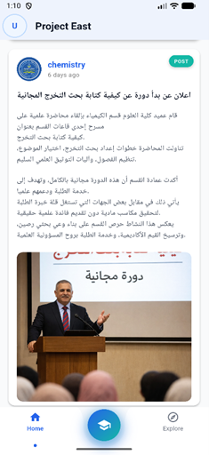
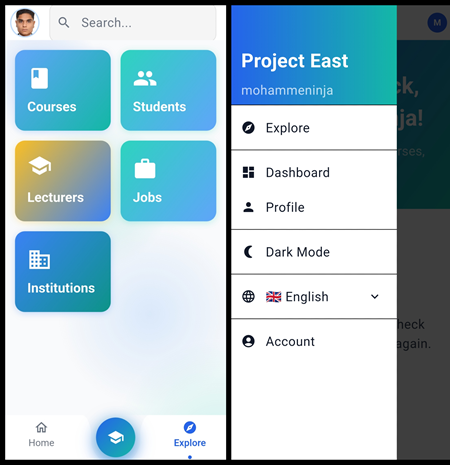
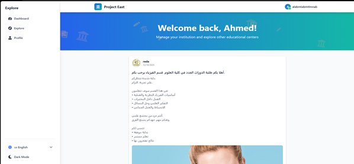
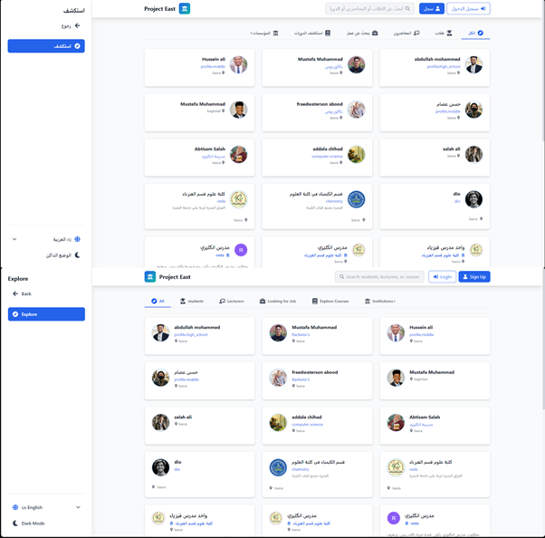
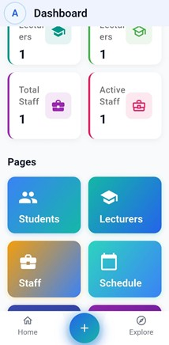
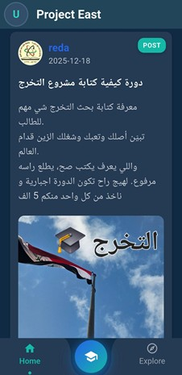
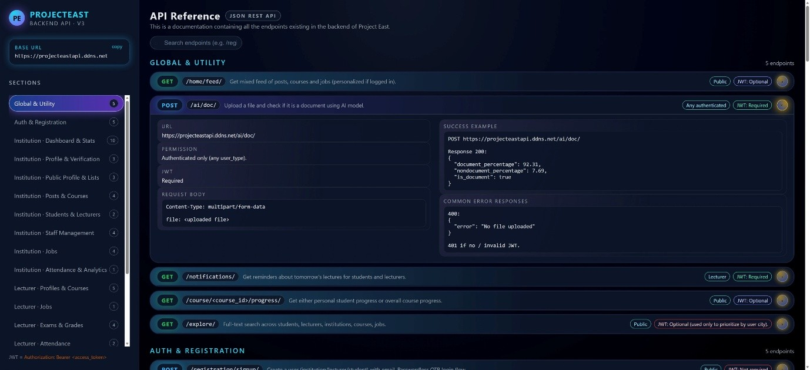
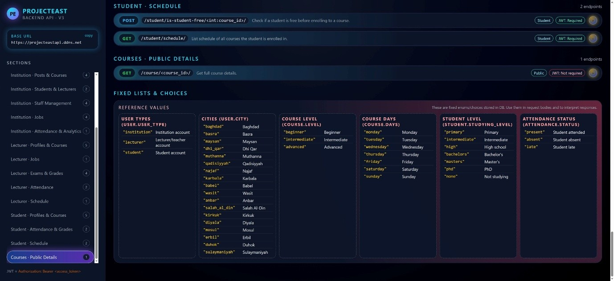

# Project East

A production-grade, multi-role academic ecosystem and social platform connecting students, lecturers, and institutions in an integrated digital workspace.

## Overview

**Project East** is an enterprise-scale academic platform engineering an interactive social networking experience with structured institutional administration tools. Built on a decoupled monolithic architecture, the system coordinates an advanced Python Django REST API backend alongside reactive multi-platform clients: an intuitive React JS administration web application and an elegant Flutter cross-platform mobile application natively configured for iOS and Android.

The backend orchestrates an extensive array of over **80+ highly optimized API endpoints** managing complex role-based routing matrix filters, live automated scheduling engines, dynamic content feeds, Stripe transactional systems, and an integrated **Ultralytics YOLO AI document classifier service** to instantly evaluate and verify institutional onboarding document uploads.

---

## Technical Features Deep Dive

### Multi-Role Security & Permissions Grid

- Implements comprehensive role-based access controls (RBAC) separating operational states for **Students, Lecturers, and Institutional Administrators**.
- Custom workspace drawers route users to contextual control decks based on verified account hierarchies (e.g., _Explore, Dashboard, Profile, and Security_ views).

### Integrated Document Verification AI Pipeline

- Incorporates a specialized computer vision inference node (`POST /ai/doc/`) utilizing a custom-trained **Ultralytics YOLO Model**.
- Analyzes document multi-part form payloads asynchronously to output an immediate, high-confidence decimal percentage match (`"document_percentage": "92.31"`) determining authentic registration claims.

### Administrative Data Centers

- Provides global analytics metrics widgets tracking institution operational health variables (_Total Staff, Active Staff, Total Courses, and Enrolled Student counts_).
- Interactive scheduling matrices dynamically map class calendars, historical grade records, attendance vectors, and subscription logs.

### Social Feed & Academic Matrix

- Displays high-fidelity, social-media-style academic timelines capable of rendering posts with embedded images, category badge parameters, and localized text alignments.
- Real-time search tools handle complex algorithmic categorization filters (filtering by _Courses, Students, Lecturers, Active Jobs, or Registered Institutions_).

### Transaction Infrastructure

- Uses production-grade **Stripe Payment API** hooks to manage premium course access keys, processing institutional memberships, and handling localized transaction tokens securely.

---

## Tech Stack

- **Backend Architecture:** Python, Django REST Framework, PostgreSQL
- **Multi-Platform Frontend Client:** Dart, Flutter SDK (Mobile UI)
- **Web Administration Panel:** React JS, JavaScript (ES6+), HTML5, CSS3 Tailwind
- **Artificial Intelligence Node:** Python, Ultralytics YOLO (Document Classifier / Computer Vision)
- **Infrastructure & Cloud Deployment:** Docker containers, Nginx reverse proxies, Linux environments, DDNS routing protocols, Google Cloud Platform (GCP)

---

## Project Structure

```bash
project-east/
├── ai/                        # Custom-trained computer vision model source files and weights
├── backend/                   # Django REST Framework source files and PostgreSQL pipeline rules
├── frontend/                  # Multi-platform client source trees
│   ├── flutter_app/           # Cross-platform mobile repository handling iOS and Android UI
│   └── react/                 # React JS administration panel web application code
├── screenshots/               # Production interface visualization logs
├── .gitignore                 # Active file ignore mappings filtering build and SDK caches
├── api_doc.html               # Clean, self-hosted interactive REST API reference guide
└── README.md                  # Comprehensive project portfolio documentation
```

---

## Interface Architecture Showcase

### Flutter Mobile Experience (Real-Time Academic Feed & Global Search)

  

_Figure 1: Custom-rendered academic social timeline, live interactive categorical explorer grid, and secured user navigation drawers._

### React JS Web Administration Dashboard

  

_Figure 2: Responsive React management portal showcasing real-time institutional counter matrices, data grid management tools, and academic status monitoring configurations._

### Interactive Configuration and Theming States

  

_Figure 3: Course enrollment operational routes, mobile metric dashboards, and responsive system configuration layers matching dark and light mode UI preferences._

### Self-Hosted Interactive API Reference Guide



_Figure 4: Fully documented endpoints layout tracking authentication requirements, form parameters, request boundaries, and example success response blocks._



_Figure 5: Core reference matrices defining target data types, internationalized city keys, level classifications, and enumeration arrays used across input JSON payloads._

---

## Setup & Local Installation

### Prerequisites

- Python 3.10 or higher installed locally
- Flutter SDK & Node.js operational environments
- Docker Desktop setup configured

### Core Backend Launch Steps

- Clone the architectural repository layout onto your environment:

  ```bash
  git clone https://github.com
  cd project-east/backend
  ```

- Provision and isolate a local python dependency environment container:

  ```bash
  python -m venv venv
  source venv/bin/activate  # Linux/macOS execution path
  # venv\Scripts\activate   # Windows shell path shortcut
  ```

- Fetch the production application requirements profile using pip:

  ```bash
  pip install -r requirements.txt
  ```

- Run database migration workflows to instantiate your PostgreSQL ledger matrix:

  ```bash
  python manage.py migrate
  ```

- Boot up the localized multi-threaded development web server engine:
  ```bash
  python manage.py runserver
  ```

## Author

H2SO4-1191 – Software Engineer
